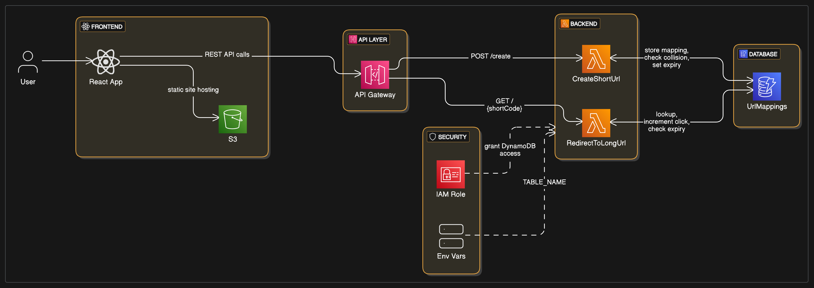

# Shrinkr - A Serverless URL Shortener

**Shrinkr** is a fully serverless URL shortener built using **ReactJS** (Frontend), **AWS Lambda (Node.js)** (Backend), and **Amazon DynamoDB** (Storage). It generates compact, shareable URLs for long links with optional custom aliases and expiry.

This project is designed to be **scalable**, **cost-effective**, and **cloud-native**.

## Live app link: http://shrinkr-frontend.s3-website-us-east-1.amazonaws.com/

## 🚀 Features

- **Custom aliases** supported
- **Base64-based short code generation** with collision detection
- **Expiry date** (TTL) support
- Tracks clicks of the shortned URL
- Fast redirection using API Gateway + Lambda
- 100% serverless = No running cost if unused

---

## 🧪 How It Works

1. **User** submits a long URL (optionally with a custom alias or expiry).
2. **Lambda function**:
   - Validates the URL
   - Generates a **7-character base64** short code using `crypto.randomBytes`
   - Checks for collision in DynamoDB
   - Stores the mapping along with TTL
3. **API Gateway** maps the short code to Lambda.
4. On visiting the short URL, user is **redirected** to the original URL.

---

## 🛠 Architecture Diagram



---

## 🚀 Live app


---

## 🛠 Tech Stack

| Layer       | Technology               |
| ----------- | ------------------------ |
| Frontend    | ReactJS + AWS S3         |
| Backend     | Node.js + AWS Lambda     |
| API Gateway | REST API Gateway         |
| Database    | DynamoDB                 |
| Security    | IAM roles, Env Variables |

---

## 🧮 How to decide the Short URL length?

To ensure uniqueness and scalability, we calculated the ideal short code length based on expected traffic:

```
Assume:
x = 10,000 requests/minute and we expect to store the URLs for 10 years
y = x * 60 * 24 * 365 * 10 = total URLs in 10 years
y = 10,000 * 60 * 24 * 365 * 10 = ~5.2 billion

Now, to encode y unique values in base62 (A-Z, a-z, 0-9):
shortURL length = log62(y)

log62(5.2B) ≈ 6.5 ≈ 7 characters
```

➡️ Therefore, we use a 7-character base64 string (filtered for URL-safe characters) to generate each short code. This allows us to handle billions of unique short URLs while keeping them compact and memorable.

---

## 🚀 Setup Instructions

### 1. DynamoDB Table Creation

- Table name: `UrlMappings`
- Primary key: `shortCode` (String)
- Add optional TTL attribute: `expiryAt` (Number - epoch time)

<!-- ### 2. IAM Role for Lambda

- Create a role with the following permissions:
  - `AmazonDynamoDBFullAccess` (or more restrictive custom policy)
  - `AWSLambdaBasicExecutionRole` -->

### 2. Lambda Function (Node.js)

- Runtime: **Node.js 18+**
- Create functions `CreateShortUrl` and `RedirectToLongUrl` and paste the cost from `AWS/Lamda/CreateShortUrl` and `AWS/Lamda/RedirectToLongUrl`
- Add **Environment Variable**:
  - `TABLE_NAME = UrlMappings`
- Deploy the lambda function

### 3. Add IAM Permissions to Lambda

- Go to each Lambda function → Configuration → Permissions
- Under "Execution role", click the role name.
- Click “Add permissions” → “Attach policies”
- Add `AmazonDynamoDBFullAccess`

### 4. API Gateway

- Create a REST API
- POST `/create` → Lambda for generating shortened URL
- GET `/{shortCode}` → Lambda for redirection logic

### 5. ReactJS Frontend

- Go to the fontend folder
- Install dependecies by `npm i`
- Create an `.env` file and place
  `VITE_BACKEND_URL=PLACE_API_GATEWAY_ENDPOINT_HERE`

---
